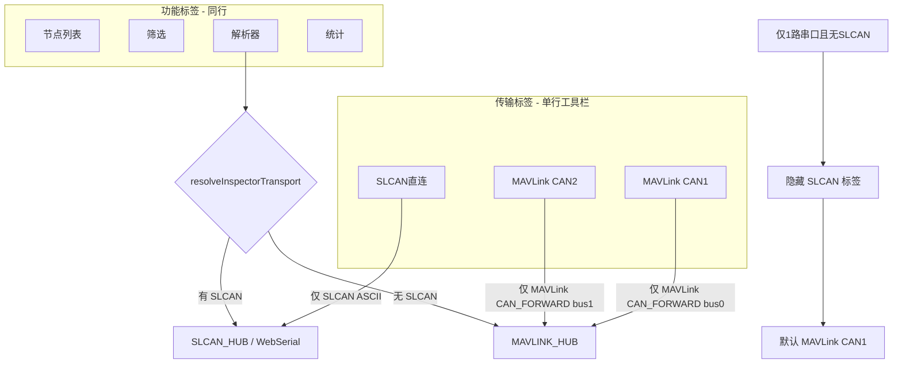

# DroneCAN 传输隔离与解析器自动选源

日期: 2026-06-07  
状态: **已实施**

## 概述

在 DroneCAN 页面实现 SLCAN / MAVLink CAN1 / CAN2 三路传输严格隔离；单串口无 SLCAN 时自动隐藏 SLCAN 传输标签；解析器按「有 SLCAN 优先，否则 MAVLink CAN」自动选源。UI 采用单行标签栏，传输与功能页混排，通过 `data-dc-transport` / `data-dc-view` 区分。

---

## 目标行为



| 场景 | 行为 |
|------|------|
| SLCAN 标签 | 只开 SLCAN 会话；只 poll SLCAN 节点；参数读写只走 SLCAN 写口 |
| MAVLink CAN1/2 | 只 `CAN_FORWARD` + 只 poll 对应 bus 的 MAVLink 节点；读写走 MAVLink |
| 仅 1 路串口、无 SLCAN | **隐藏** SLCAN 传输标签；自动 `setTransport('can1')` |
| 解析器 | `isSlcanTransportAvailable()` 为真 → SLCAN；否则 → MAVLink CAN1（只读观测，不 merge 两路） |
| 筛选 / 统计 | 跟随当前 `currentTransport`（解析器除外，用 `inspectorTransport`） |

---

## 架构调整

### 1. 前端状态（单行 UI）

```javascript
let currentTransport = "slcan";   // slcan | can1 | can2
let currentView = "nodes";        // nodes | filter | inspector | stats
let inspectorTransport = null;    // 解析器实际观测源
```

单行工具栏 7 个按钮：

- 传输：`slcan` | `can1` | `can2`（`sc-dc-transport-tab`）
- 功能：`filter` | `inspector` | `stats`（节点列表 = 选中传输标签时 `data-dc-panel="nodes"`）

`setTransport(t)` / `setView(v)` 替代原 `setMode()`。

### 2. 可用性门禁 `syncTransportTabs()`

`isSlcanTransportAvailable()` 综合：`detectSlcanAdapterPort()`、`countSlcanEligibleWebPorts()`、COM 桥 `probeRole===slcan` 等。

无 SLCAN 时隐藏 SLCAN 标签并切到 MAVLink CAN1。**禁止** SLCAN 模式下 fallback 到 MAVLink。

### 3. 独立运行时存储

| Store | 用途 | source 过滤 |
|-------|------|-------------|
| `slcanRuntime` | SLCAN 标签 + 解析器 SLCAN 路径 | `SLCAN Direct` |
| `mavlinkCan1Runtime` | CAN1 标签 | `MAVLink CAN1` |
| `mavlinkCan2Runtime` | CAN2 标签 | `MAVLink CAN2` |

`getActiveRuntime()`：`currentView === 'inspector' ? inspectorTransport : currentTransport`。

### 4. 轮询与会话

| 函数 | 职责 |
|------|------|
| `ensureSlcanSession()` | 仅 SLCAN 开串口/WebSerial；失败报错，不 fallback |
| `ensureMavlinkCanSession(bus)` | 仅 `CAN_FORWARD` |
| `pollTransportTraffic()` | 按 active transport poll 对应 API |
| `ensureInspectorSession()` | `resolveInspectorTransport()` 后选路 |
| `resolveInspectorTransport()` | SLCAN 可用 → `slcan`；否则已连 MAVLink → `can1`；否则 `none` |

### 5. MAVLink 帧注入门控

- `mavlink.js` → `feedMavlinkCanFrameIfActive(bus, ...)`
- 仅 CAN1/CAN2 标签或解析器走 MAVLink 时写入 `mavlinkCan*Runtime`
- `slcan-web-serial.js` → `feedSlcanCanFrame`，且 `isSlcanCanFeedActive()` 门控

### 6. 发送路径隔离

- `slcan` → Web Serial / `POST /slcan-write`
- `can1`/`can2` → `POST /mavlink-can-write` 或 `window.sendMavlinkCanFrame`
- `nodeParameterAccessHint()`：节点 `source` 与 `currentTransport` 不匹配时拒绝 Parameters

### 7. 后端 API

| 端点 | 说明 |
|------|------|
| `GET /slcan-nodes` | `source_prefix=SLCAN` |
| `GET /mavlink-can-nodes?bus=1\|2` | `source_prefix=MAVLink` + bus 过滤 |
| `POST /mavlink-can-write` | `{ bus, id, data, len }` 经 `MAVLINK_HUB` 发 CAN_FRAME |

### 8. UI 文案

- 徽章：`SLCAN 直连` / `MAVLink CAN1` / `MAVLink CAN2`
- 解析器 summary：`数据源: …`（无 SLCAN 时注明已自动切换）
- CAN2 未配置时标签 `disabled` + tooltip

---

## 关键文件

| 文件 | 变更 |
|------|------|
| [JS/ui/dronecan-setup.js](../JS/ui/dronecan-setup.js) | 状态拆分、工具栏、poll/send 隔离、inspector 选源 |
| [JS/core/mavlink.js](../JS/core/mavlink.js) | 条件 feed |
| [JS/services/serial.js](../JS/services/serial.js) | `sendMavlinkCanFrame` |
| [JS/services/slcan-web-serial.js](../JS/services/slcan-web-serial.js) | SLCAN feed 门控 |
| [tools/com-bridge/server.py](../tools/com-bridge/server.py) | 新 API + status bus 过滤 |
| [tools/com-bridge/test_slcan_auto.py](../tools/com-bridge/test_slcan_auto.py) | 双 API 隔离测试 |
| [docs/dronecan-slcan-mavlink-source-mixing-20260606.md](./dronecan-slcan-mavlink-source-mixing-20260606.md) | 架构说明（简版） |

---

## 实施清单（已完成）

- [x] 后端：`status` bus 过滤 + `/mavlink-can-nodes` + `/mavlink-can-write`
- [x] 前端：状态拆分 + 工具栏单行 7 标签 + `syncTransportTabs`
- [x] 删除 SLCAN fallback；独立 runtime + `pollTransportTraffic`
- [x] `mavlink.js` 门控 feed + CAN_FRAME 发送
- [x] 解析器 `resolveInspectorTransport` + summary 数据源展示
- [x] 参数读写 transport 校验 + 测试与文档

---

## 相关背景

原混源问题记录见 [dronecan-slcan-mavlink-source-mixing-20260606.md](./dronecan-slcan-mavlink-source-mixing-20260606.md)。
