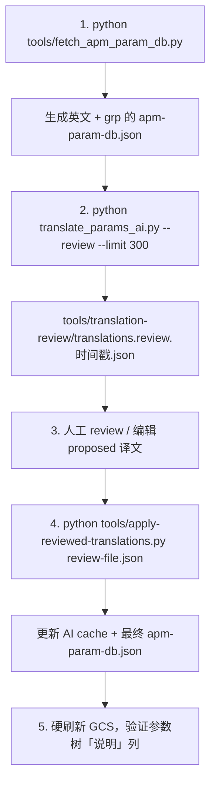

# 参数说明（d 字段）高质量 AI 精翻 + Reviewable 工作流

## 目标
为「配置调试」参数树中每个参数的**长描述（d 字段 / 说明列）**提供专业、术语一致的简体中文翻译。

- 仅翻译 `d`（说明），**不翻译**短显示名 `n`。
- 采用 reviewable 流程：AI 先产出，人工 review 后再正式合并。
- 保留最新 Schema C 的 `grp` / `grpBySrc` 等元数据。

## 整体流程（推荐）



## Provider 选择（OpenAI / xAI / DeepSeek）

脚本目前支持三种后端（全部走 reviewable d-only 流程）：

- **自动识别**（默认）：`--provider auto`。仅当 key 以 `xai-` 开头时自动走 xAI，其余走 OpenAI。
- **DeepSeek**（推荐当 xAI 余额不足时）：必须显式使用 `--provider deepseek` + `--api-key-env DEEPSEEK_API_KEY`。
  DeepSeek key 通常也是 `sk-` 开头，无法从前缀自动区分，因此需要明确指定。
- **xAI**：`--provider xai` 或让 key 以 `xai-` 开头自动识别。
- **OpenAI**：默认或 `--provider openai`。

推荐环境变量与模型：
- DeepSeek：`DEEPSEEK_API_KEY`，默认模型 `deepseek-v4-flash`（用户实测可用）
- xAI：`XAI_API_KEY`，默认模型 `grok-4.3`
- OpenAI：`OPENAI_API_KEY`，默认模型 `gpt-5.4-mini`

### DeepSeek 使用示例（最常用场景）

```bash
export DEEPSEEK_API_KEY="sk-你的deepseek密钥"
python translate_params_ai.py \
  --review \
  --limit 300 \
  --batch-size 20 \
  --api-key-env DEEPSEEK_API_KEY \
  --provider deepseek \
  --model deepseek-v4-flash
```

所有 review / cache / apply 流程对三种后端完全透明，译文质量主要靠 glossary + 强 prompt 保障。

## 详细步骤

### 1. 获取最新英文元数据（含 grp）
```bash
python tools/fetch_apm_param_db.py
# 或离线使用缓存
python tools/fetch_apm_param_db.py --offline
```

这会同时更新 `JS/data/apm-param-db.json`（带 grp）和 `apm-param-db.en.json`（纯英文快照）。

### 2. AI 翻译（Review 模式，只翻译 d）
```bash
# 推荐：先小批量试点（OpenAI）
python translate_params_ai.py --review --limit 400 --batch-size 20

# 使用 DeepSeek（deepseek-v4-flash）—— xAI 没余额时的实用选择
export DEEPSEEK_API_KEY="sk-你的deepseek密钥"
python translate_params_ai.py --review --limit 300 --batch-size 20 \
    --api-key-env DEEPSEEK_API_KEY --provider deepseek --model deepseek-v4-flash

# 使用 xAI（Grok）
export XAI_API_KEY="xai-你的密钥"
python translate_params_ai.py --review --limit 300 --api-key-env XAI_API_KEY --provider xai

# 或者让脚本自动检测 xAI（key 以 xai- 开头时自动走 xAI）
export XAI_API_KEY="xai-..."
python translate_params_ai.py --review --limit 300 --api-key-env XAI_API_KEY

# 全量（谨慎，建议分批）
python translate_params_ai.py --review
```

关键参数：
- `--review`：强制仅处理 d 字段，输出 review JSON 而非直接改 db。
- `--limit`：控制本次翻译数量，便于分波 review。
- `--provider auto|openai|xai`：选择后端，`auto`（默认）会根据 key 前缀自动识别 xAI。
- `--api-key-env`：指定环境变量名（xAI 推荐使用 `XAI_API_KEY`）。
- 输出文件位于 `tools/translation-review/translations.review.<ts>.json`

xAI 默认模型为 `grok-4.3`（当前旗舰，高质量），可通过 `--model` 覆盖（例如 `grok-4.20-0309-reasoning`）。

### 3. 人工 Review
打开生成的 review JSON 文件，逐条检查：

- `proposed` 是 AI 给出的翻译。
- 可以直接编辑 `proposed` 字段。
- 把 `"status": "pending"` 改成 `"accepted"` 表示接受。
- 删除不想要的条目。
- 也可以新增 `"accepted": "最终接受的译文"` 字段。

**强烈建议优先 review 安全相关分组**：
- FS_*（链路失效保护）
- ARMING_*（解锁检查）
- RTL_*（返航）
- BATT_*（电池）
- ATC_*（姿态控制）

### 4. 应用已 Review 的翻译
```bash
python tools/apply-reviewed-translations.py tools/translation-review/translations.review.20260529-....json --dry-run
python tools/apply-reviewed-translations.py tools/translation-review/translations.review.20260529-....json
```

工具会：
- 只合并状态为 accepted 的 d 翻译。
- 更新 `apm-param-translate-cache.ai.json`
- 安全合并到 `apm-param-db.json`（保留 grp、grpBySrc 等所有元数据）
- 自动创建备份

### 5. 验证
- 硬刷新 GCS（或重启开发服务器）。
- 打开「配置调试」标签。
- 展开任意参数的「说明」列，检查：
  - 术语是否与安全面板一致（失效保护、解锁前检查、位掩码、返航等）。
  - 位定义、取值列表格式是否完整。
  - 长文本是否可读、无歧义。

## 术语表
核心术语集中在：
`tools/glossary-param-translation.json`

AI Prompt 会自动加载该表。人工 review 时也请参考此表保持一致。

## 推荐节奏（降低风险与成本）
1. Pilot（安全关键组）：FS_*、ARMING_*、RTL_*、BATT_*、ATC_*（约几百条）
2. 第二波：常见控制与导航相关（Q_、WPNAV_、LOIT_、POS_ 等）
3. 后续分批覆盖剩余全部 d 字段。

每次 Pilot 后在真实 GCS 里验证，再决定是否继续下一批。

## 注意事项
- fetch 永远产出英文 + grp。中文是后续叠加的。
- 不要直接用旧的 `translate_params.py`（Google/MyMemory）做生产中文。
- review 文件可以安全提交或分享给团队 review。
- 最终 `apm-param-db.json` 的 diff 会很大（属正常）。

## 相关文件
- `translate_params_ai.py` — 核心 AI 翻译 + review 模式
- `tools/apply-reviewed-translations.py` — review 结果应用工具
- `tools/glossary-param-translation.json` — 术语表
- `docs/parameter-translation-workflow.md` — 本文档

---

需要更新或补充术语表、Prompt 示例时，请同步修改 `glossary-param-translation.json` 和 `prompt-examples/description-only-translation-prompt.md`。